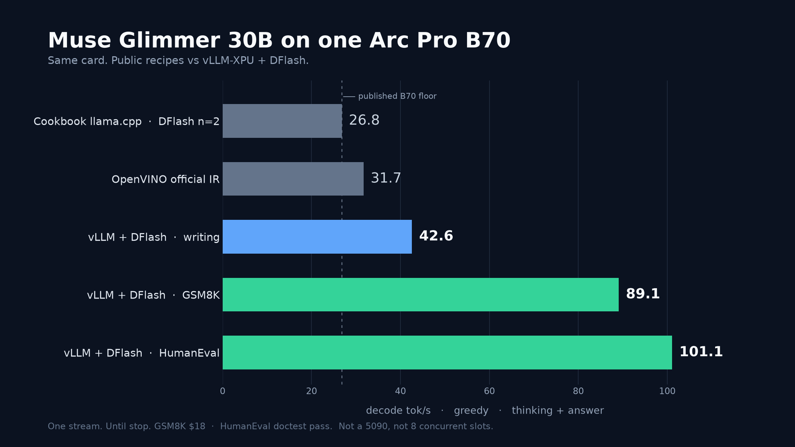

# Muse Glimmer at 90 tok/s on one Arc Pro B70

Public numbers for Meta’s [Muse Glimmer 30B](https://huggingface.co/meta-models/Muse-Glimmer-30B) on a single Intel Arc Pro B70 have lived in the high 20s. The best documented llama.cpp recipe — [SergiioB’s B70 cookbook](https://github.com/SergiioB/intel-arc-pro-b70-inference-cookbook/blob/master/docs/muse-glimmer/MUSE-GLIMMER-B70.md) — is **26.8 tok/s** median decode (28.9 peak) at 128k context with DFlash `n_max=2`. We ran that class of config on the same card and landed in the same place.

Then we changed stack. Same GPU, vLLM-XPU, GPTQ W4A16, XPU graphs, and a 20-token DFlash draft. On a suite that **finishes answers** — not a 128-token thinking window — greedy single-stream decode is:

| Prompt | Decode tok/s | E2E tok/s | Time to first visible token | What we checked |
|---|---:|---:|---:|---|
| GSM8K (Janet’s ducks) | **89.1** | 86.7 | 6.1 s | answer **$18** |
| HumanEval/0 | **101.1** | 99.3 | 8.4 s | **doctest pass** |
| MT-Bench 81 (Hawaii post) | **42.6** | 42.3 | 8.5 s | 4.6k-character post |

Writing is still the hard cluster. Math and code speculate. Quote the table, not a blended average.

Decode is tokens after the first generated chunk; e2e includes time-to-first-token. Both count thinking **and** the answer, because Muse always thinks. A run only counts if it stopped on its own, emitted visible content, and passed the check. Protocol: [`docs/share-suite.md`](docs/share-suite.md).

---

## What “published on B70” actually looks like

We started by running the configs other people publish, on one B70, through the public OpenAI streaming API.

| Source | Stack | What they measured | tok/s |
|---|---|---|---:|
| [SergiioB cookbook](https://github.com/SergiioB/intel-arc-pro-b70-inference-cookbook/blob/master/docs/muse-glimmer/MUSE-GLIMMER-B70.md) | llama.cpp SYCL, UD-Q4_K_XL, DFlash `n_max=2`, 128k | engine decode, p512/g128 | **26.8** median / 28.9 max |
| Us, same recipe class | llama.cpp SYCL F16 + DFlash `n_max=2` | public streaming C1 | **26.6** |
| Us, Meta GGUF + Vulkan | llama.cpp Vulkan, Dynamic Q4, DFlash `n_max=2` | public streaming C1 | **27–32** |
| [OpenVINO IR](https://huggingface.co/OpenVINO/Muse-Glimmer-30B-int4-ov) | GenAI 2026.4 `VLMPipeline` on GPU | 128-token generate | 26.3 cold / **31.7** warm |
| [Intel day-0](https://www.intel.com/content/www/us/en/developer/articles/community/day-0-local-agentic-ai-with-metas-muse-glimmer.html) | OpenVINO, DFlash, assistant tokens = 8 | B70 config published; no tok/s in the article | — |
| [Meta model card](https://huggingface.co/meta-models/Muse-Glimmer-30B) | llama.cpp, RTX 5090 | greedy, batch 1, mixed prompts | 74.9 no-spec / **233** with DFlash |

The cookbook is the honest single-B70 baseline. We did not beat it by “running llama.cpp harder.” SYCL without oneDNN matched 26.8. Vulkan DFlash matched the same band. OpenVINO’s official INT4 IR was ~32 warm — and we never got Intel’s `assistant tokens = 8` DFlash path to light up on that IR. Deeper llama.cpp DFlash2 on SYCL got **slower** (n=8: 11 tok/s) and died.

So the public B70 story was real: about **30 tok/s** on the engines Meta and Intel pointed people at.

Meta’s 5090 number is a different GPU and a 3.1× DFlash win. The B70 llama.cpp configs were using **2 of the 16 tokens** the drafter was trained to propose. That is the whole plot.

---

## How we got from 30 to 90

Four changes. Each one had to win on the live API, not a kernel microbench.

**1. Stop shipping K-quant through a generic GEMV path.**
Glimmer’s short decode on this card is weight traffic, not KV. Dynamic Q4 in llama.cpp is a fine 32 GB fit; it is not a Battlemage W4A16 kernel. We quantized the 30B target to GPTQ 4-bit / group 128 / symmetric and served it with vLLM-XPU’s `XPUwNa16` kernel. No speculation: about **31.5 tok/s**. That is already cookbook-class, before DFlash.

**2. Use the official DFlash drafter inside vLLM, not llama.cpp’s n=2 cap.**
vLLM’s DFlash method verifies a block against the 30B target. Eager, `num_speculative_tokens=15`: sky-prompt decode **42–44 tok/s**. Same speculation idea as the cookbook, more of the trained block.

**3. Capture the verify step.**
Eager mode spent ~70–75 ms every step on launch overhead, so extra draft tokens were almost free and almost useless. Turn on XPU graphs, drop `--enforce-eager`, set depth to **20**. Sky 256-token decode jumped to **48 tok/s** with a BF16 draft. n=32 got slower: the draft forwards are serial and fall out of the graph.

**4. Quantize the five-layer drafter too.**
The assistant is 4.8 GiB BF16 or 1.6 GiB GPTQ. vLLM’s fast DFlash context-KV path wants a fused `qkv_proj.weight`; GPTQ only has `qweight`, so we overlay a packed-QKV fallback that still uses the quantized kernel. GPTQ draft vs BF16 draft, same graph setup: **52.9 vs 48.0** sky decode (+10%), acceptance 1.56 vs 1.58. That's what's running.

What we did **not** keep: fused KV-only projections (~0.5% of step time), llama.cpp DFlash2, Vulkan cap tuning, and vLLM `extract_hidden_states` on this Muse/XPU build (it asserts in page-size math). Do not put `torch.xpu.synchronize()` on the serving path — it changed the acceptance stream.

The 89 / 101 numbers are not “we found a 90 tok/s sky prompt.” They are what happens when the draft is allowed to be right for a while: GSM8K and HumanEval accept ~3–4 tokens per verify. A Hawaii blog post still accepts ~1.2. If you only ever bench “why is the sky blue,” you will publish 53 and miss the coding-agent workload this model is for.

---

## Reproduce
You need one Arc Pro B70 (32 GB), Linux `xe`, Docker, and `/dev/dri`. This is not CUDA.
GPTQ trees (4-bit, G128, symmetric, `desc_act=false`, GPTQModel 7.3.2), Apache 2.0, derived from [meta-models/Muse-Glimmer-30B](https://huggingface.co/meta-models/Muse-Glimmer-30B):
1. **Download weights**
```bash
hf download mgaruccio/Muse-Glimmer-30B-GPTQ-Int4-sym-G128 --local-dir ./models/target
hf download mgaruccio/Muse-Glimmer-30B-assistant-GPTQ-Int4-sym-G128 --local-dir ./models/draft
# then compare shard hashes to docs/checksums.md
```
2. **Launch** (pinned image, kernels 0.1.13.2, graphs, n=20, overlay `DFLASH_KV_MODE=none`):
```bash
export MODEL="$PWD/models/target"
export DRAFT="$PWD/models/draft"
export DFLASH_KV_MODE=none
bash scripts/start-muse-vllm-dflash-c1-graph-draft-gptq.sh
bash scripts/wait-vllm-health.sh 420 8000
curl -sf http://127.0.0.1:8000/v1/models
```
Expect served id `muse-glimmer-gptq`. Logs: `XPUwNa16LinearKernel`, `num_spec_tokens=20`, patch `mode=base`. The launcher binds `0.0.0.0:8000` and `docker rm -f`s that container name. Override `PORT`, `NAME`, and `RENDER_NODE` if `/dev/dri/renderD128` is not your GPU.
3. **Measure**
```bash
python3 scripts/vllm-dflash-share-suite.py 3 2048 share-suite.json
```
The process exits non-zero if any prompt is not quoteable. Do not publish a headline from a partial run. Details: [`docs/share-suite.md`](docs/share-suite.md).
Muse streams `delta.reasoning` then `delta.content`. A client that only reads `content` looks idle until thinking finishes.
Rebuild from BF16 (optional, **not** bit-identical to the Hub trees; needs CUDA + GPTQModel 7.3.2): `scripts/quantize-muse-glimmer-gptq.py` and `scripts/quantize-muse-dflash-assistant-gptq.py`.
One stream. Not Spec-Bench, not a 5090, not eight concurrent llama.cpp slots. One B70, the published recipes as a floor, and a vLLM DFlash stack that actually writes the answer.
