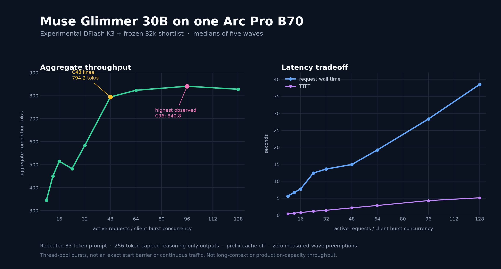

# Glimmer B70: experimental C8–C128 concurrency sweep

Measured 2026-09-06 on one Intel Arc Pro B70. This is a **separate experimental
profile**, not a replacement for the published C1/K20 or C8/K4 recipes in this
repository. It combines DFlash K3 with a frozen 32,768-token draft vocabulary
shortlist. Serving defaults remain unchanged.



## Result

The highest observed median was **840.810 aggregate completion tok/s at C96**.
C128 regressed to 827.754 tok/s while median request time rose to 38.516 seconds.
For this particular workload, **C48 is the practical throughput/latency knee**:
794.194 tok/s—only 5.5% below C96—with roughly 20 individual decode tok/s versus
10.6 at C96. This is not a production capacity recommendation or proof of a
global maximum.

| Active concurrency | Aggregate tok/s | Median TTFT (s) | Median request (s) | Individual decode tok/s | Completed-answer checks |
|---:|---:|---:|---:|---:|---:|
| 8 | 345.346 | 0.429 | 5.644 | 49.073 | 8/8 |
| 12 | 449.944 | 0.621 | 6.710 | 42.039 | 11/12 |
| 16 | 514.712 | 0.790 | 7.712 | 36.988 | 15/16 |
| 24 | 482.247 | 1.167 | 12.438 | 22.678 | 24/24 |
| 32 | 583.812 | 1.452 | 13.597 | 21.146 | 32/32 |
| 48 | 794.194 | 2.169 | 14.938 | 19.994 | 48/48 |
| 64 | 823.297 | 2.866 | 19.213 | 15.656 | 64/64 |
| 96 | **840.810** | 4.308 | 28.346 | 10.586 | 95/96 |
| 128 | 827.754 | 5.129 | 38.516 | 7.680 | 127/128 |

Every cell reached its named active-request peak, completed five measured waves,
reported zero measured-wave preemptions and metric errors, then drained cleanly.
The graph-memory capture rose from 0.84 GiB at C8 to 3.89 GiB at C128. The C24
dip was not explained by a large speculative-acceptance collapse; its cause was
not isolated.

## What was measured

This is a **concurrent thread-pool burst** workload, not an exact barrier and not
continuous traffic:

- One fixed 140-character sky prompt, **83 tokens after chat formatting**.
- Temperature 1, top-p .95, top-k 64, seed 42; prefix cache disabled.
- One warmup wave, then five measured waves at each C.
- Every request had a 256-token output cap. Aggregate rate is total completion
tokens divided by wave wall time, including scheduling, prefill, generation and
streaming/client overhead.
- All **2,140 measured** responses stopped at that length cap while still
producing reasoning. None contained final-answer content. The throughput number
therefore counts reasoning tokens.

A separate smoke suite sent C simultaneous requests with a 2,048-token budget
across repeated math, code and prose tasks. All 428 completed with non-empty
content; 424/428 passed the unchanged automated extraction. The four apparent
failures correctly stated $18/day, then ended with “9 eggs,” which the unchanged
last-integer grader selected. This smoke suite is not a broad quality evaluation
and does not produce the throughput rate.

The server advertised a native **131,072-token prompt-plus-output** limit at
every cell, but the throughput input was only 83 tokens. Do not extrapolate
these numbers to long-context sessions, varied prompt/output lengths, tool
loops, or uninterrupted arrival traffic.

## Experimental artifact and source

The frozen shortlist is public at the assistant model repository, revision
[`d3296b5`](https://huggingface.co/mgaruccio/Muse-Glimmer-30B-assistant-GPTQ-Int4-sym-G128/tree/d3296b5f0bb2a346ada2c76e7d0449ceca4ca68e):

```bash
hf download mgaruccio/Muse-Glimmer-30B-assistant-GPTQ-Int4-sym-G128 \
  artifacts/glimmer-b70-k3-shortlist-32768.json \
  --revision d3296b5f0bb2a346ada2c76e7d0449ceca4ca68e --local-dir ./artifacts
sha256sum ./artifacts/artifacts/glimmer-b70-k3-shortlist-32768.json
# d7f243cf376c5fe16a172530d0bb76ab0ee7e3b852b20fec66b8fdcc4a9314ea
```

The JSON contains only format/size metadata and 32,768 sorted original-token
IDs; it intentionally omits calibration prompts, frequency votes, raw streams,
host telemetry, and weights. The experimental head patch and historical runner
are pinned in [`b70-inference@faf4ba9`](https://github.com/mgaruccio/b70-inference/tree/faf4ba9889254719c878728fdd1a48806e7fd88b/scripts/experimental).
Those snapshots have fixed campaign paths and are not a clone-and-run launcher.

## Boundaries and follow-ups

No independent cold repeat, high-concurrency native retrieval, longer-input
stress, mixed-prompt run or continuous-arrival run was performed after the sweep.
Those are deferred rather than failed tests. No C>128 cell was attempted.

The older [C8/K4 native-context profile](concurrency.md) remains independently
documented and uses a different draft-head/configuration. Its 278.1 tok/s C8
number is not directly comparable with the experimental 345.346 tok/s C8/K3
shortlist cell here.

## Source and references

- [Full source research report at `b70-inference@faf4ba9`](https://github.com/mgaruccio/b70-inference/blob/faf4ba9889254719c878728fdd1a48806e7fd88b/docs/glimmer-b70-concurrency-sweep-20260906.md)
- [vLLM optimization guide](https://docs.vllm.ai/en/latest/configuration/optimization.html) — preemption, CPU streaming overhead and throughput/latency tradeoffs.
- [vLLM metrics](https://docs.vllm.ai/en/stable/usage/metrics/) — scheduler and preemption observability.
